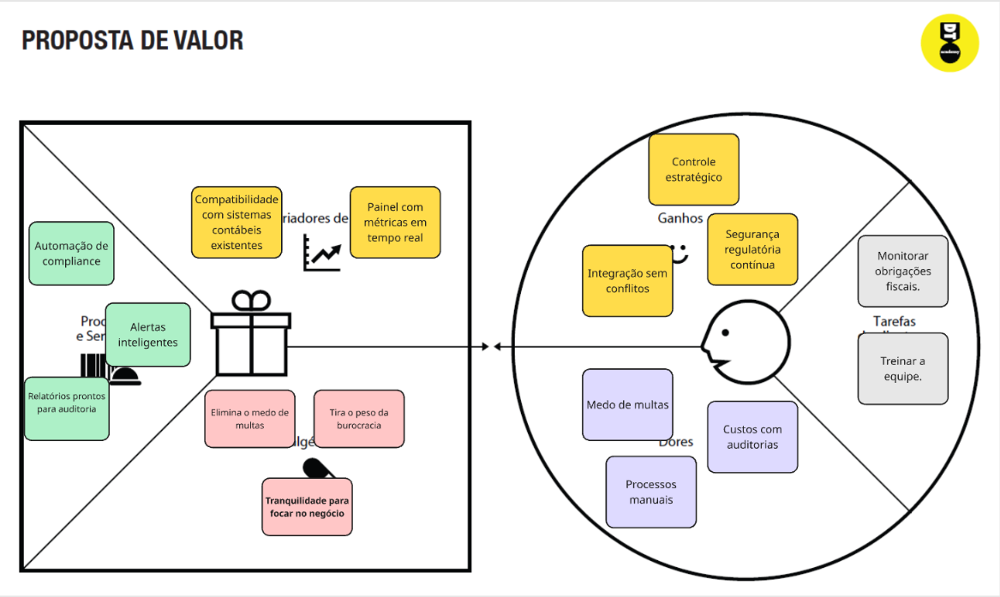
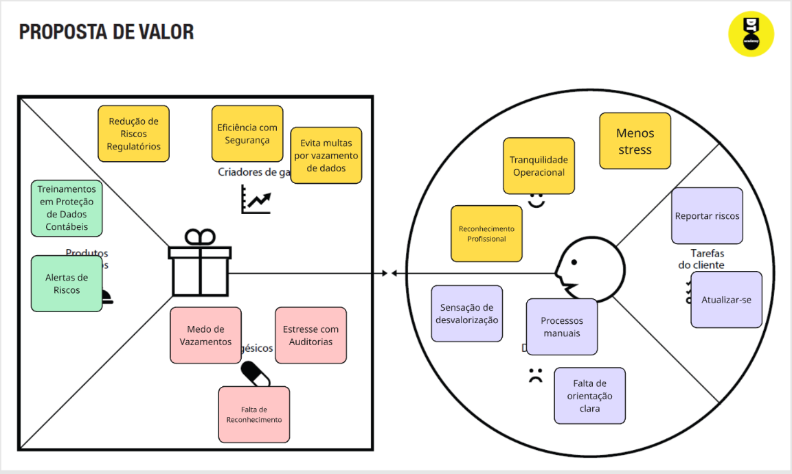

# Product design

## Histórias de usuários

Com base na análise das personas, foram identificadas as seguintes histórias de usuários:

|EU COMO... `PERSONA`| QUERO/PRECISO ... `FUNCIONALIDADE` |PARA ... `MOTIVO/VALOR`                 |
|--------------------|------------------------------------|----------------------------------------|
|Ronald, dono de um escritório de contabilidade  | ter uma ferramenta que integre conformidade fiscal e segurança de dados de forma automatizada         | garantir que minha empresa esteja sempre em conformidade com as exigências legais e reduzir os riscos de erros ou falhas de segurança que possam prejudicar a reputação do meu negócio.               |
|Ronald, dono de um escritório de contabilidade     | uma ferramenta que me ajude a monitorar em tempo real o status de conformidade fiscal e contábil da minha empresa         | poder tomar decisões rápidas e informadas, reduzindo o risco de multas ou penalidades e garantindo que minha empresa esteja sempre em dia com as obrigações legais. |
|Laura, estagiária no TJMG  | ter acesso a informações claras e aplicáveis sobre direito digital e segurança         | poder aplicar esse conhecimento de forma prática e ética na minha futura carreira jurídica, especialmente em questões de ética digital e segurança               |
|Laura, estagiária no TJMG       | Modelos de documentos prontos (ex.: pareceres sobre conformidade com a LGPD).         | Reduzir o tempo de pesquisa em fontes dispersas. |
|Gustavo, funcionário de um escritório de contabilidade  | uma plataforma que me permita acessar e aplicar as normas contábeis de forma prática e intuitiva         | evitar erros no meu trabalho diário e ganhar mais confiança na execução das minhas tarefas, contribuindo para o crescimento da empresa e da minha carreira.               |
|Gustavo, funcionário de um escritório de contabilidade       | receber treinamentos claros e práticos sobre normas contábeis e de segurança         | aplicar essas normas no meu dia a dia de trabalho sem complicações e me sentir mais seguro e confiante em minhas habilidades. |

## Proposta de valor

## Requisitos

As tabelas a seguir apresentam os requisitos funcionais e não funcionais que detalham o escopo do projeto. Para determinar a prioridade dos requisitos, aplique uma técnica de priorização e detalhe como essa técnica foi aplicada.

### Requisitos funcionais

| ID     | Descrição do Requisito                                   | Prioridade |
| ------ | ---------------------------------------------------------- | ---------- |
| RF-001 | O sistema deve permitir o cadastro, edição e exclusão de políticas de compliance com validação do conselho. | ALTA       |
| RF-002 | O sistema deve disponibilizar treinamentos e testes interativos sobre compliance.
 | ALTA     |
| RF-003 | O sistema deve fornecer uma area para solicitações. | BAIXA       |
| RF-004 | O sistema deve gerar relatórios automáticos de auditoria e conformidade. | MÉDIA     |
| RF-005 | O sistema deve possibilitar diferentes níveis de acesso conforme o perfil do usuário. | ALTA       |
| RF-006 | O sistema deve enviar notificações automáticas sobre atualizações de políticas | ALTA     |
| RF-007 | O sistema deve armazenar logs de acesso e ações dos usuários para fins de auditoria. | MÉDIA       |
| RF-008 | O sistema deve integrar-se a empresa de forma humanitaria.
 | MÉDIA     |
| RF-009 | O sistema deve apresentar um painel simples e direto.
 | ALTA       |
| RF-0010 | O sistema deve permitir exportar relatórios em múltiplos formatos (PDF, Excel, etc.) | MÉDIA     |

### Requisitos não funcionais

| ID      | Descrição do Requisito                                                              | Prioridade |
| ------- | ------------------------------------------------------------------------------------- | ---------- |
| RNF-001 | O sistema deve ser responsivo e acessível via navegadores em dispositivos móveis e desktops. | ALTA     |
| RNF-002 | O sistema deve cumprir normas de segurança de dados como a LGPD e o GDPR.          | ALTA      |
| RNF-003 | O sistema deve apresentar alta disponibilidade para não interromper os serviços prestados.          | MÉDIA      |

## Restrições

O projeto está restrito aos itens apresentados na tabela a seguir.

|ID| Restrição                                             |
|--|-------------------------------------------------------|
|001| Orçamento Limitado |
|002| Conformidade com Normas  |
|003| Infraestrutura Tecnológica  |
